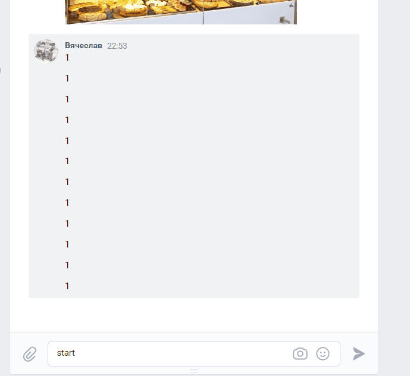

# VK store bot
______
Витрина выпечки/кондитерской. 3-4 раздела, в каждом по 2-3 товара. У товара описание и фотография. Из раздела можно возвращаться назад. Для навигации используются кнопки.
______
В проекте 2 версии бота:
* v1 логика бота реализована внутри на  inline-кнопках
* v2 логирока реализована в машине состояний (FSM)
______
Данные хранятся в БД:

______

